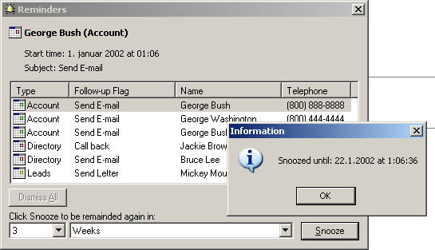



## Reminder \- Date/Time Manipulation \(\+\)

### Description

This code is a demo for the two functions I wrote (GetFutureTime and GetFutureDate). I used it in a project to Snooze reminders like in Microsoft Outlook. The date function returns a date, for example, "12/12/2002" + "3 weeks". The time function returns a time, for example, "12:12:00" + "45 minutes". ENJOY!
 
### More Info
 

             |
---                |---
**Submitted On**   |2002-01-01 01:07:26
**By**             |[Milos Todorovic](https://github.com/Planet-Source-Code/PSCIndex/blob/master/ByAuthor/milos-todorovic.md)
**Level**          |Beginner
**User Rating**    |4.7 (33 globes from 7 users)
**Compatibility**  |VB 6\.0
**Category**       |[Math/ Dates](https://github.com/Planet-Source-Code/PSCIndex/blob/master/ByCategory/math-dates__1-37.md)
**World**          |[Visual Basic](https://github.com/Planet-Source-Code/PSCIndex/blob/master/ByWorld/visual-basic.md)
**Archive File**   |[Reminder\_\-3682611222001\.zip](https://github.com/Planet-Source-Code/milos-todorovic-reminder-date-time-manipulation__1-29113/archive/master.zip)

